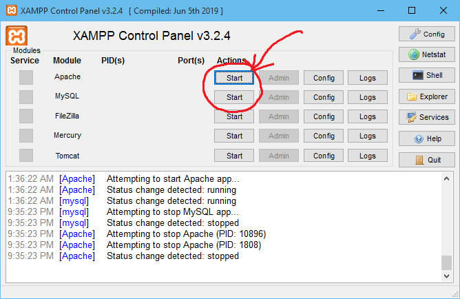

## Setup

If you (like me) don't want to set up VirtualBox like in the lecture slides,

1. Install [XAMPP](https://www.apachefriends.org/index.html)
2. Create a new folder in `C:\xampp\htdocs\` and name it `ee4717-project` or something
3. Dump all these files in that folder
4. Launch XAMPP Control Panel and click Start on Apache and MySQL. 
5. Go to phpMyAdmin, create a new database `f32ee` if it doesn't exist yet
6. Import `doctors.sql` and `users.sql` from the `sql` folder
7. Open [localhost/ee4717-project](http://localhost/ee4717-project). You should see the index page.
8. Have fun 😊

## Recommended development tools

* [VS Code](https://code.visualstudio.com/)
  * [Emmet](https://www.youtube.com/watch?v=ZtyMdRzvi0w) - Built-in feature to type HTML faster 
* VS Code extensions
  * Live Server - automatically reloads pages when you save new changes to HTML/CSS/Javascript files
  * PHP Server - serves PHP without XAMPP or VirtualBox. Even though I pointed it to the PHP exectuable from XAMPP 😀
  * [Live Server Extension](https://github.com/ritwickdey/live-server-web-extension) - automatically reload when you save new changes to PHP files. [StackOverflow thread that helped me troubleshoot this](https://stackoverflow.com/a/64542693)